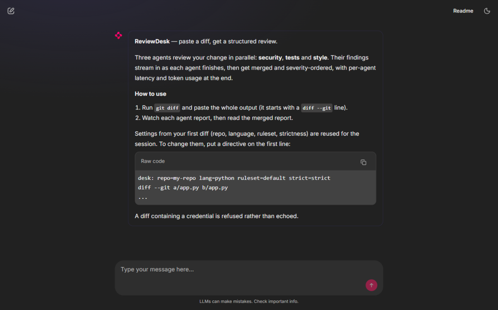
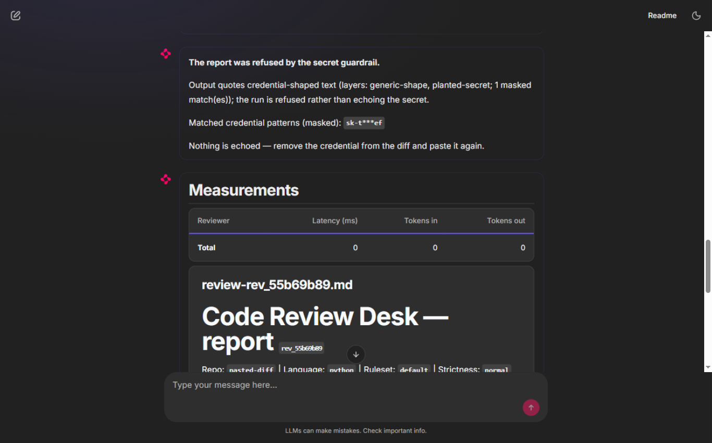
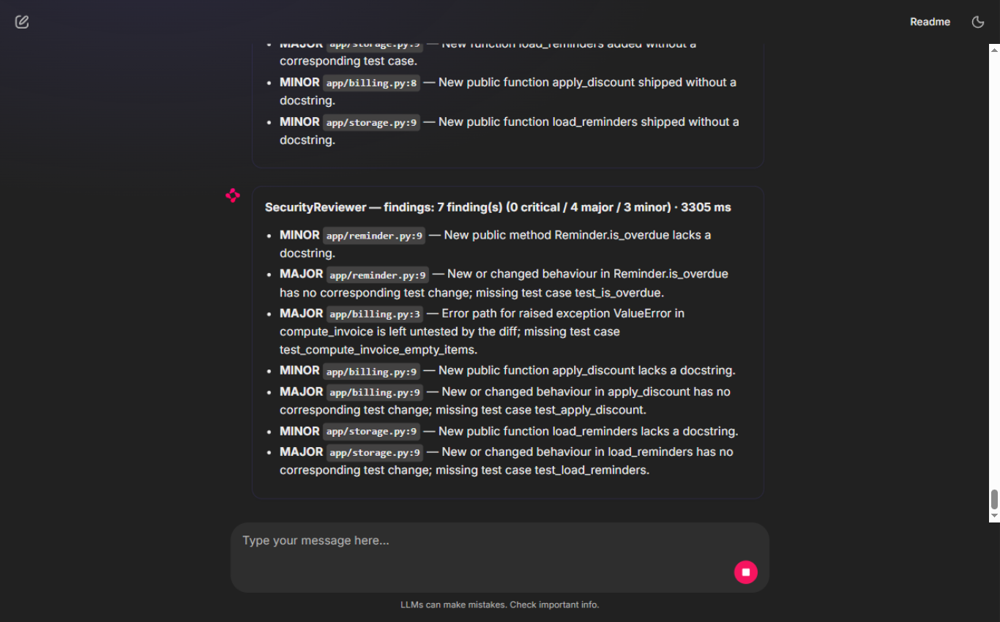
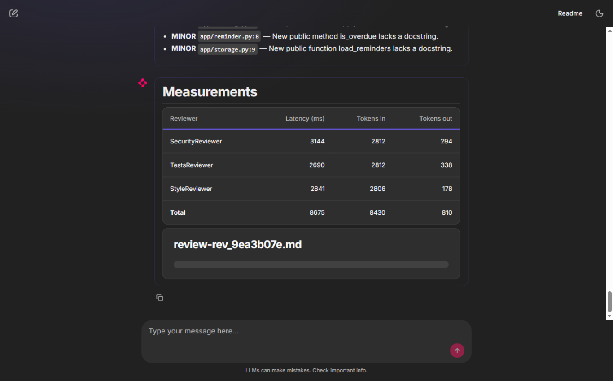
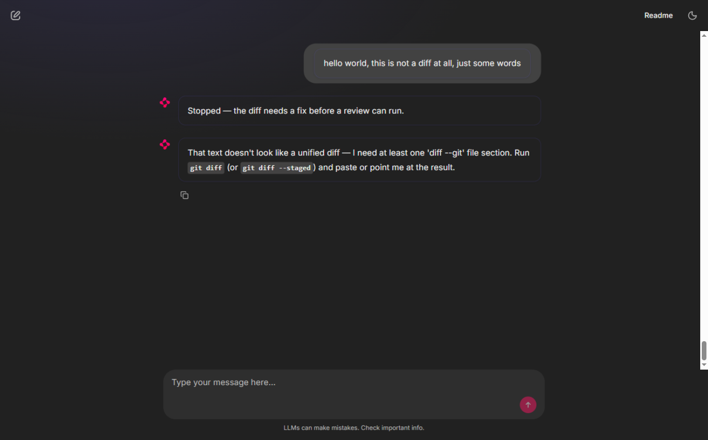
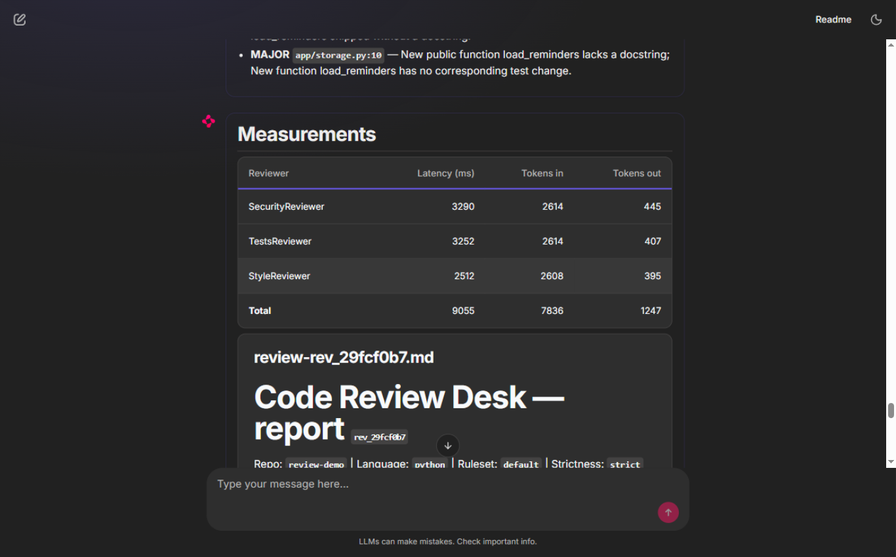

# Code Review Desk

A production-shaped agentic code-review pipeline built on the **OpenAI Agents
SDK (Python)** with **Google Gemini** models behind a failover model router,
and a **Chainlit** UI (branded **ReviewDesk**) that streams findings as they
land.

A unified diff goes in; three reviewer agents — **security**, **tests**,
**style** — read it *at the same time*; a Desk agent merges their findings via
a Merge specialist exposed with `as_tool`, and hands the conversation to a
**Remediation** specialist by typed-input **handoff** when a critical security
finding exists. An **output guardrail** refuses anything that quotes a secret
found in the diff. Every run is ledgered; every review is one trace.

## Quick start

```bash
python -m venv .venv
.venv/Scripts/pip install -r requirements.txt   # Windows/Git Bash
cp .env.example .env                             # then fill in both keys
```

Keys (never commit `.env`):

- `GEMINI_API_KEY` — drives **all** model calls (through the router).
- `OPENAI_API_KEY` — used **only** to export traces to
  <https://platform.openai.com/traces> (FR-13). Missing key ⇒ tracing is
  disabled with one sentence and the app still runs.

### Run the Desk

```bash
# UI (preferred on Python 3.14 — see "Python 3.14 note" below)
.venv/Scripts/python run_ui.py                   # http://localhost:8000

# CLI review of a diff file
.venv/Scripts/python cli.py --diff examples/three_file_issue.diff --repo demo --language python --ruleset default

# Strict mode + run-level model override (FR-7: same agent objects, no edits)
.venv/Scripts/python cli.py --diff examples/three_file_issue.diff --repo demo --language python --ruleset default --strict --model-override gemini-3.5-flash-lite

# FR-5 evidence: concurrent vs sequential wall clocks, side by side
.venv/Scripts/python cli.py --diff examples/three_file_issue.diff --concurrent-timing
```

Paste a unified diff into the chat to review it. A second diff in the same
session reuses the stored context. Optional first-line directive:

```
desk: repo=my-repo lang=python ruleset=default strict=normal
```

### Tests

```bash
.venv/Scripts/python -m pytest -q
```

### Python 3.14 note

`chainlit run app.py` starts the chat fine, but chainlit 2.11's unconditional
`nest_asyncio.apply()` breaks anyio on Python 3.14 and static assets (JS/CSS)
fail to serve. **Use `python run_ui.py`**, which pre-empts that patch before
launching the same Chainlit app.

## Architecture

```
diff ──► intake (split per file, BEFORE any model call)
          │
          ├─ SecurityReviewer ─┐
          ├─ TestsReviewer   ──┤  three clones of one base reviewer,
          └─ StyleReviewer   ──┘  asyncio.gather (concurrent, FR-5)
                 │
                 ▼
           ReviewDesk agent
           ├── merge_findings  ← MergeSpecialist via as_tool (dedupe + severity order)
           └── handoff ───────► RemediationSpecialist (typed Escalation input,
                                 on critical security findings)
                 │
                 ▼
        ReviewReport + footer (per-reviewer latency + real token usage)
```

Every voice (reviewers, Desk, Merge, Remediation) carries the same output
guardrail; the pipeline plants the diff's credential patterns before any agent
runs, and a tripwire becomes a visible refusal — never an echo, never a crash.

### Module map

| Module | Responsibility |
|---|---|
| `src/model_config.py` | The **only** place model names live: Gemini client factory, rate-limit table, priority model (`PRIORITY_MODEL`, default `gemini-2.5-flash`), `FailoverModel` with automatic failover on 429/quota/rate-limit **and model-not-found**, per-model usage + cooldowns, run-level override helper (FR-7). |
| `src/intake.py` | Diff reading/splitting (async entry), `ReviewContext` dataclass, ruleset loader (failures become sentences). |
| `src/review.py` | `Finding` model, base reviewer (dynamic instructions from ruleset + language, terser under strict; forced ruleset tool via `tool_choice="required"`), three clones, concurrent fan-out, turn ceiling 4 with partial-review catch. |
| `src/specialists.py` | Desk agent, Merge specialist (`as_tool`), Remediation (typed-input handoff), the secret output guardrail + credential detectors. |
| `src/observe.py` | Run-level hooks (per-reviewer latency + real usage), agent-level hooks on exactly one reviewer, `LedgerRunner` (one JSON line per run to `ledger.jsonl`, registered once at startup), tracing setup. |
| `src/pipeline.py` | `run_review` async event stream, `ReviewReport`, footer renderer; catches guardrail tripwires and turn ceilings. |
| `app.py` / `run_ui.py` | Chainlit UI: progressive severity-styled cards, status messages, measurement footer, session-state context reuse, custom CSS. |
| `cli.py` | Async CLI entry with `--strict`, `--model-override`, `--sequential`, `--concurrent-timing`. |

### Model router

`src/model_config.py` encodes the rate-limit table verbatim:

- **15 RPM:** `gemini-3.5-flash-lite`, `gemini-3.1-flash-lite`
- **5 RPM:** `gemini-3.8-flash`, `gemini-3.7-flash`, `gemini-3.6-flash`,
  `gemini-3.5-flash`, `gemini-3-flash`, `gemini-2.5-flash`

The chain starts at the priority model (env `PRIORITY_MODEL`, default
`gemini-2.5-flash`) and follows the table. On any limit hit — RPM, TPM, RPD,
quota/429, or model-not-found (the provider deprecates old models for new
keys) — the router switches to the next model, applies cooldowns, tracks
per-model usage, and retries transparently. Agents never see the switch.

### Ledger

`LedgerRunner` appends one line per run to `ledger.jsonl`:

```json
{"ts": "2026-09-25T06:00:00.123Z", "request_id": "rev_8f21", "agent": "SecurityReviewer", "ms": 2140, "findings": 3, "model": "...", "tokens": 1500}
```

Registered once at startup (`LEDGER_RUNNER` in `src/observe.py`); removing
that registration is the only change needed to switch the ledger off. No agent
definition mentions it.

## Screenshots

From a live integrated-browser session (see `evidence/screenshots/` for the
full set):

**Welcome** — clean, emoji-free start screen:



**Secret guardrail refusal** — a diff containing a planted credential is
refused with a masked pattern, never echoed:



**Progressive findings** — cards land per agent while the review is still
running (note the stop button — the desk is mid-review):



**Measurements footer** — per-agent latency and REAL token usage from the run
contexts:



**Malformed diff** — a friendly message, never a traceback:



**Strict-mode review** — a `desk: repo=review-demo strict=strict` directive
honoured; full report attached per review:



## Requirements traceability

| Req | Where |
|---|---|
| FR-1 | `src/intake.py` (`split_diff`, `intake`, `DiffError`), async `cli.py` |
| FR-2 | `ReviewContext` via `RunContextWrapper` everywhere; tool schema has no wrapper; prompts carry no repo name |
| FR-3 | `Finding` + `output_type=list[Finding]`; `final_output` is a plain list |
| FR-4 | Dynamic instructions in `src/review.py` (ruleset + language; terser when strict) |
| FR-5 | `asyncio.gather` fan-out + `--concurrent-timing` wall-clock evidence |
| FR-6 | Merge via `as_tool` (Desk keeps the conversation); Remediation via typed-input handoff |
| FR-7 | `--model-override` → `RunConfig(model=...)`; zero agent edits |
| FR-8 | Output guardrail on every voice; planted-pattern matching; refusal, never an echo |
| FR-9 | Forced ruleset tool (`tool_choice="required"` + `reset_tool_choice`); tools return sentences; turn ceilings caught → partial reviews |
| FR-10 | Run-level hooks + footer with real usage from run contexts; agent-level hooks on one reviewer |
| FR-11 | `LedgerRunner`, one line per run, one registration |
| FR-12 | `app.py`: progressive findings, session-state reuse, awaited async pipeline |
| FR-13 | One trace per review (`workflow_name` + `group_id=request_id`), exported under `OPENAI_API_KEY` |
| NFR-1..5 | `.env` gitignored before first commit; bounded model settings per agent; traceable + ledgered; tools never raise; spec committed before code (`git log`) |

Evidence transcripts: [`evidence/dod_transcript.txt`](evidence/dod_transcript.txt)
(regenerate with `.venv/Scripts/python evidence/dod_runs.py`).
